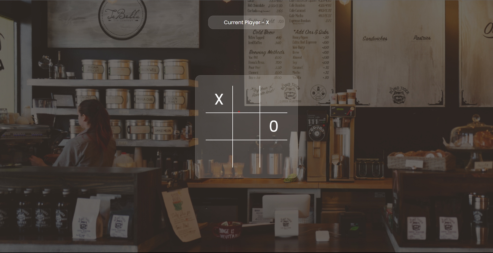
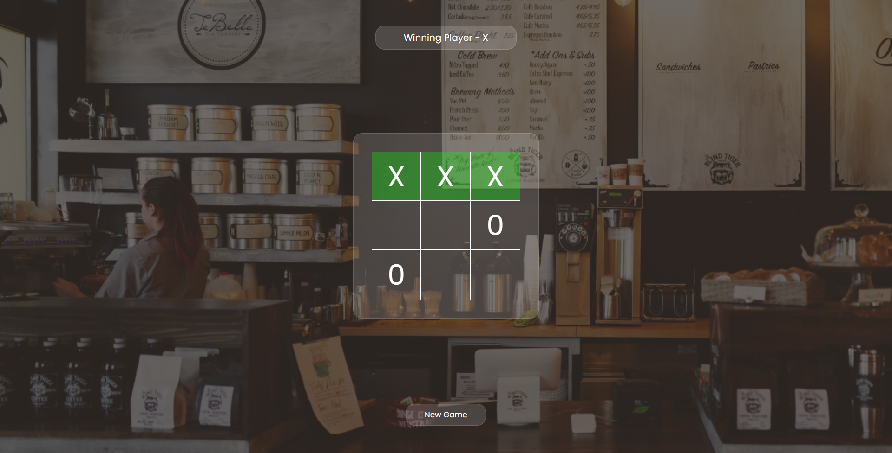

# Tic Tac Toe Game

The Tic Tac Toe Game is a fun and interactive web-based game designed for two players. This project serves as a platform for improving logic-building skills and exploring styling techniques. The game allows two players to take turns, tracks the active player's turn, and highlights the winning moves at the end of the game.




## Table of Contents

- [Overview](#overview)
- [Installation](#installation)
- [Usage](#usage)
- [Features](#features)
- [Technologies Used](#technologies-used)
- [Contributing](#contributing)
- [License](#license)

## Overview

The Tic Tac Toe Game offers an engaging gaming experience with the following features:

- **Two-Player Gameplay:** Two players can take turns to play the game, making it a great option for friendly competitions.

- **Active Player Indicator:** The game displays whose turn it is, ensuring both players stay informed.

- **Winning Highlight:** At the end of the game, the winning moves are highlighted with a green background color, and the winner is announced.

This project provides an opportunity to enhance logic-building skills and practice front-end styling.

## Installation

1. Clone the repository:

   ```bash
   git clone https://github.com/sargunkohli152/Tic-Tac-Toe.git

2. Open your code editor and start the application

## Usage
 - Open the game in a web browser.

 - Two players take turns to click on the available cells to place their respective symbols (X or O).

 - The game tracks whose turn it is and displays it on the screen.

 - The game ends when a player wins or there is a draw. Winning moves are highlighted with a green background.

## Features
 - Two-player gameplay.
 - Active player indicator.
 - Winning move highlighting.
 - Engaging and interactive gaming experience.


## Technologies Used
 - HTML 
 - CSS
 - JavaScript


## Contributing
Contributions are welcome! If you have any suggestions, improvements, or want to add new features to enhance the Tic Tac Toe Game, please fork the project, make your changes, and submit a pull request.

## License
MIT License

Permission is hereby granted, free of charge, to any person obtaining a copy of this software and associated documentation files (the "Software"), to deal in the Software without restriction, including without limitation the rights to use, copy, modify, merge, publish, distribute, sublicense, and/or sell copies of the Software, and to permit persons to whom the Software is furnished to do so, subject to the following conditions:

The above copyright notice and this permission notice shall be included in all copies or substantial portions of the Software.

THE SOFTWARE IS PROVIDED "AS IS", WITHOUT WARRANTY OF ANY KIND, EXPRESS OR IMPLIED, INCLUDING BUT NOT LIMITED TO THE WARRANTIES OF MERCHANTABILITY, FITNESS FOR A PARTICULAR PURPOSE AND NONINFRINGEMENT. IN NO EVENT SHALL THE AUTHORS OR COPYRIGHT HOLDERS BE LIABLE FOR ANY CLAIM, DAMAGES OR OTHER LIABILITY, WHETHER IN AN ACTION OF CONTRACT, TORT OR OTHERWISE, ARISING FROM, OUT OF OR IN CONNECTION WITH THE SOFTWARE OR THE USE OR OTHER DEALINGS IN THE SOFTWARE.
